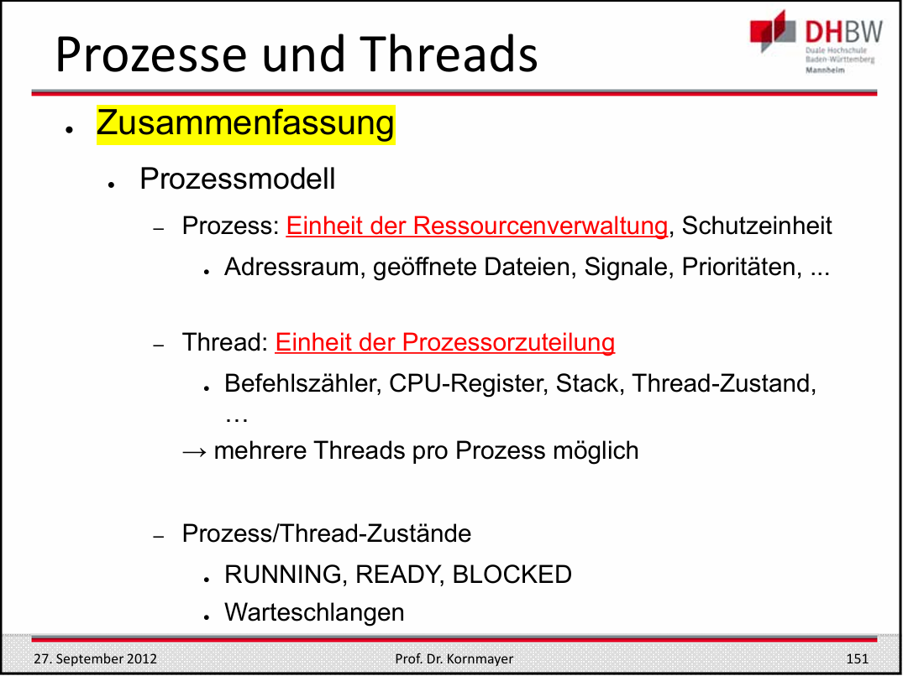

## Prozesse und Threads

### Prozesse
`"Prozesse sind Programme in Ausführung"`  
`"Prozesse sind eine Schutzeinheit im Betriebssystem"`

Prozessmodell: 

Dabei notwendige Daten für einen Prozess:
- P-ID (Prozess-ID), Eltern-Prozess, Kind-Prozess[], Benutzer-ID,
- Registerinhalte, Programmzähler
- Zustand
- Speicher
- Dateien

Datenmodell eines Prozesses:
#### Prozesstabelle mit einem Eintrag pro Prozess (dabei enthält der PCB, also der Prozesskontrollblock, alle Informationen, die für die Verwaltung eines Prozesses notwendig sind):

| **Prozessverwaltung**                              | **Speicherverwaltung**                            | **Datenverwaltung**                                |
|----------------------------------------------------|--------------------------------------------------|----------------------------------------------------|
|    PID, Eltern-Prozess, Kind-Prozess[],    | ?             | geöffnete Dateien, PWD, Executable I/O Daten |

#### Prozesswechsel:
Ablauf:
- Sichern des Befehlszähler, Prozessorstatus, etc.
    - Prozess auf "blocked" setzen
- Ursache der Unterbrechung feststellen
- Ereignis (z.b. Ende der E/A) entsprechend behandeln
    - Blockierten Prozess auf "ready" setzen
- Sprung zum Scheduler
    - Auswahl des nächsten Prozesses

### Threads
`"Threads sind Ausführungseinheiten innerhalb eines Prozesses"`

Threadmodell erweitert das Prozessmodell um die Möglichkeit, mehrere Ausführungseinheiten innerhalb eines Prozesses zu haben. Dabei muss das Prozessdatenmodell erweitert werden, so kann es mehrere Registerinhalte und Programmzähler geben, sowie einzelne Handlungsstränge, die in unterschiedlichen Zuständen sein können.:

- Prozess-ID, Eltern-Prozess, Kind-Prozess[], Benutzer-ID
- Registerinhalte **[]**, Programmzähler **[]**
- Zustand **[]**
- Speicher 
- Dateien

#### Hauptvorteile von Threads:
-  Mehrere Ausführungfäden mit gleichem Adressraum
    - Daten gemeinsam nutzbar
- Ausführung im Benutzermodus möglich
- Erstellung ist 10-100 mal schneller als bei Prozessen

#### Lebenszyklus eines Threads:
- **Erzeugung von Threads**
    - Prozess startet einen Thread, der neue Threads erzeugt (create)  
        --> Argument: Name der Prozedur, die ausgeführt werdedn soll  
        --> keine Angabe des Addressraums notwendig  
        --> Thread wird im selben Adressraum wie der erzeugende Thread erzeugt
- **Beendigung von Threads**
    - Thread beendet sich selbst (exit)
    - Thread wird von anderem Thread beendet (kill)
- **Syncronisation von Threads**
    - Thread wartet auf Beendigung eines anderen Threads (join)
    - Thread wird von anderem Thread geweckt (signal)
- **Freiwiliige Unterbrechung**
    - Thread gibt die CPU freiwillig ab (yield)  
        --> Scheduler beauftagen einen anderen Thread auszuführen

#### Zusammenfassung:

### Interprozess-Kommunikation

#### Interprozess-Kommunikation (IPC)
`Interprozess-Kommunikation ist der Austausch von Informationen zwischen Prozessen`  

#### Drei Probeleme bei IPC:
- **Kommunikation**
    - Informationen von einem prozess an andere (strukturiert) weiterleiten 
- **Ressourcen Knappheit**
    - Vermeiden des gleichzeitigen Zugriffs auf gemeinsame Ressourcen
- **Deadlocks**
    - Ablauf von Prozessen organisieren, wenn Abhängigkeiten vorliegen

`Beide letzten Aspekte gelten auch für Threads.
Im folgenden wird jedoch nur auf Prozesse eingegangen.`

#### Race Conditions
- Prozesse nutzen gemeinsame Ressourcen (Festplatte, Drucker, etc.)
- Endergebnis hängt vom Ablauf ab --> Dieser ist jedoch nicht reproduzierbar  
--> **Also Race Conditions UNBEDINGT vermeiden!**

- Vermeidbar mittels Synchronisation 
#### Wechselseitiger Ausschluss
- **Kritischer Abschnitt**
    - Codeabschnitt, der auf gemeinsame Ressourcen zugreift
**4 Bedingungen für wechselseitigen Ausschluss:**
1. Keine zwei Prozesse sind gleichzeitig in kritischen Regionen
2. Keine Annahme über die Geschwindigkeit und Anzahl der CPU
3. Kein Prozess außerhalb des kritischen Abschnitts darf andere Prozesse blockieren
4. Kein Prozess darf auf unbestimmte Zeit auf den Eintritt in den kritischen Abschnitt warten

#### Mögliche Lösungen für wechselseitigen Ausschluss:
**1. Interrupts Ausschalten:**

- **Funktionsweise:**
    - Prozesswechsel erfolgen durch Interrupts, außer bei freiwilliger Abgabe der CPU
    - begin_region(): Sperrt Interrupts
    - end_region(): Freigabe der Interrupts 
- **Probleme:**
    - funktioniert nur auf Einprozessorsystemen
    - E/A-Operationen ist blockiert
    - Ein Prozess im Benutzermodus übernimmt die Kontrolle über das Betriebssystem (--> Was wenn die Interrupts nicht mehr aktiviert werden?) 

    --> Das Betriebssystem nutzt diesen Ansatz, aber **nur** im Kern-Modus

**2. Sperrvariablen:**
- **Funktionsweise:**
    - Variable belegt zeigt an, ob krirtischer Abschnitt belegt ist  

- **Problem:** Verhindert Race Conditions nicht sicher 
    -   Prozesse führen begin_region() gleichzeitig aus
    - Lesen gleichzeitig die Variable belegt
    - Finden belegt auf False
    - Setzen dann belegt auf True und betreten den kritischen Abschnitt

**3. Strikter Wechsel:**

- **Funktionsweise**
    - Variable `turn` zeigt an, welcher Prozess den kritischen Abschnitt betreten darf

- **Problem:**
    - Verletzt die Anforderungen 3 und 4 des wechselseitigen Ausschlusses --> Prozesse müssen abwechselnd in den kritischen Abschnitt eintreten

**4. Lösung von Peterson:**

- **Funktionsweise:**
    - Verbindet die Ansätze von Sperrvariablen und Striktem Wechsel

- Race Condition/Verklemmungen verhindert:
    - jeder Prozess bekommt die Chance in den kritischen Abschnitt zu gelangen

- **Probleme** bei Mehrprozessorsystemen:
    - Abfrage und Setzen der Variable `turn` sind nicht atomar (also zwei Schritte)

- **LÖSUNG:** Hardwareunterstützung
    - Atomare Read-Modify-Write Operationen der CPU
        TSL (Test and Set Lock) --> Atomar
        - Bei der Ausführung wird der Speicherbus gesperrt
        - kein anderer Prozessor kann gleichzeitig auf das gemeinsame Speicherwort zugreifen

#### Effizienz-Probleme bei Petersons Lösung:

- Warteschleifen (**Spinlocks:**)
    - Prozesse blockieren nicht, sondern warten aktiv   
     --> Also Prozess belegt die CPU, obwohl er nichts tut
    - Überaschungseffekte bei der Prozessausführung:
        - Prozess H hat höhere Priorität, ist aber blockiert
        - L rechnet und wird im kritischen Abschnitt unterbrochen
        - H wird rechenbereit
        - H will in den kritischen Abschnitt, wartet aber auf L
        - L kommt nicht zum Zug solange H rechenbereit ist

    --> Busy-Waiting kann notwendig sein, also nicht grundsätzlich verwerfen

#### Erzeuger-Verbraucher-Problem:
- **Beschreibung**: Klassisches Synchronisationsproblem, bei dem Produzenten Daten erzeugen und in einen Puffer legen, während Verbraucher diese Daten aus dem Puffer entfernen.
- **Herausforderung**: Sicherstellen, dass Produzenten und Verbraucher den gemeinsamen Puffer nicht gleichzeitig manipulieren, um Dateninkonsistenzen zu vermeiden.
- **Lösungen**:
    - Verwendung von Synchronisationsmechanismen wie Semaphore, Mutexen oder bedingten Variablen.
    - Implementierung einer synchronisierten Pufferstruktur, die von Produzenten und Verbrauchern sicher gemeinsam genutzt werden kann.
- **Ziele**:
    - Korrekte und effiziente Koordination zwischen Produzenten und Verbrauchern.
    - Vermeidung von Deadlocks und Dateninkonsistenzen.

#### Semaphore:
**Allgemeines Synchronisationskonstrukt:**
- für **wechselseitigen Ausschluss**
- für **Reihenfolgensynchronisation**

- Semaphor = ganzzahlige Variable
    - 0 = keine Weckrufe
    - \>0 = ein oder mehrere Weckrufe

- 2 atomare Operationen:
    - **down**: *(Veralgemeinerung von Sleep)*
        - Falls Semaphor > 0 -->  Semaphor - 1
        - Sonst Falls Semaphor = 0 --> Prozess blockiert
    - **up**:  *(Veralgemeinerung von Wakeup)*
        - Semaphor + 1
        - Falls Semaphor <= 0 --> Wecke einen blockierten Prozess auf

#### Mutex:
- Anwendung: **wechselseitiger Ausschluss**
    - kritischer Abschnitt wird durch Mutex geschützt
- **Funktionsweise:**
    - Binäre Semaphore (0 oder 1)
        - 0 = Mutex ist frei
        - 1 = Mutex ist belegt

#### Anwendung auf das Erzeuger-Verbraucher-Problem:

- **Lösung mit Semaphoren:**
    - 2 Semaphoren: full, empty
    - 1 Mutex

*Semaphore:*
- full = 0; // verhindert das entfernen von Elementen aus dem Puffer, wenn dieser leer ist *--> Reihenfolgensynchronisation*
- empty = N; // verhindert das hinzufügen von Elementen in den Puffer, wenn dieser voll ist *--> Reihenfolgensynchronisation*
- mutex = 1; // verhindert das gleichzeitige Zugreifen auf den Puffer *--> wechselseitiger Ausschluss*

- full bzw. empty sind Scheduling-Rahmenbedingungen:
    - Erzeuger: warte, wenn der Puffer voll ist
    - Verbraucher: warte, wenn der Puffer leer ist

- **Daumenregel:**
    - Eine Semaphore für jede Rahmenbedingung (Constraint)

#### **Monitore**

- **Motivation**
    - Programmierung der Semaphoren ist schwierig
    - Reihenfolge der down/up‐Operationen ist wichtig  
        --> Falsche Reihenfolge kann zu Deadlock Situationen führen
    - Synchronisation über das gesamte Programm verteilt

- **Monitore**
    - Sammlung von Prozeduren, Variablen und Datenstrukturen
    - Zugriff auf Monitor nur über Monitor-Prozeduren *(entspricht in etwa einer Klasse)*
    - Alle Prozeduren stehen unter wechselseitigem Ausschluss  
    **--> Nur jeweils ein Prozess kann auf den Monitor zugreifen**
    - Programmiersprachkonstrukt: Realisierung durch Übersetzer
- **Realisierung**
    - **Mutex** für wechselseitigen Ausschluss
    - Für die Reihenfolgensynchronisation: **Zustandsvariablen** *(condition variables)*
        - **wait()**:
            - Blockieren des aufrufenden Prozesses
            - Aufrufender Prozess wird in die Warteschlange der Zustandsvariablen eingetragen
            - Monitor steht bis zum Ende der Blockierung anderen Prozessen zur Verfügung

    - **Reihenfolgensynchronisation**
        - **signal():**
            - Falls Warteschlange der Zustandsvariablen nicht leer:
                - Mindestens einen Prozess wecken
                - Aus der Warteschlange der Zustandsvariablen entfernen
                - Blockierung aufheben

- **Eigenschaften von Monitoren**
    - Es kann immer nur ein Prozess im Monitor aktiv sein
    - Zentrale Idee: Prozess kann auch innerhalb der kritischen Region blockiert werden, da der Lock mit dem Schlafen des Prozesses freigegeben wird  
    *Unterschied zur Sempahore, die kann nicht in der kritischen Region blockiert werden*
    - Monitor Realiesierung braucht:
        - Mutex für wechselseitigen Ausschluss
        - Zustandsvariablen für Scheduling-Rahmenbedingungen  
    *--> Semaphore ist also eine Spezialisierung des Monitors*

### Scheduling

- **Motivation**
    - Mehrere Prozesse konkurrieren um die CPU
    - Betriebssystem muss entscheiden, welcher Prozess als nächstes ausgeführt wird
        - Scheduler als Teil des Betriebssystems trifft diese Entscheidung 

- Man unterscheidet zwischen:
    - **Batch-Systemen:**
        - Viele nicht interaktive Aufträge
        - Häufig bei Großrechnern
    - **Interaktiven Systemen:**
        - Typisch für Arbeitsplatzrechner
        - Server
    - **Realzeitsystemen:**
        - Steueraufgaben
        - Multimedia-Anwendungen

#### Scheduling-Zeitpunkte

1. Bei der Erzeugung eines Prozesses --> Elternprozess oder Kindprozess
2. Bei der Beendigung eines Prozesses --> aus der Menge der rechenbereiten Prozesse (Ready) Falls kein Prozess rechenbereit ist, nehme den Leerlaufprozess des Betriebssystems
3. Der rechnende Prozess wird blockiert durch:
    - E/A-Operation, Semaphor, Monitor, etc.
    - Grund der Blockierung hat Einfluss auf Scheduling Entscheidungen
4. Ein E/A-Interrupt tritt auf --> Soll der auf E/A wartende Prozess gestartet werden?
5. Zyklische Interrupts/Timerinterrupts

#### Scheduling-Kriterien:
##### Benutzersicht:
1. **Minierung der Durchlaufszeit** *(Stapelbetrieb)*
    - Zeit zwischen Start und Beendigung eines Jobs *inklusive Wartezeit*
2. **Minierung der Antwortzeit**
    - Zeit zwischen Anforderung und Beginn der Bearbeitung
3. **Einhalten von Fristen** *(Realzeitsysteme)*
    - Ausgabe eines Ergebnisses **Muss** bis zu einem bestimmten Zeitpunkt erfolgt sein
    - Kein Datenverlust erleiden
4. **Vorhersagbarkeit**
    - Durchlaufzeit, Antwortzeit unabhängig von Systemauslastung

##### Systemsicht:
1. **Maximierung des Durchsatzes** *(Stapelbetrieb)*
    - Anzahl der fertiggestellten Jobs pro Zeiteinheit
2. **Optimierung der Prozessorauslastung** *(Stapelbetrieb)*
    - Prozentualer Anteil der Zeit, in der der Prozessor ausgelastet ist
3. **Balance**
    - Gleichmäßige Auslastung aller Ressourcen
4. **Fairness**
    - Vergleichbare Prozesse sollen gleich behandelt werden
5. **Durchsetzung von Prioritäten**
    - Prozesse mit hoher Priorität sollen bevorzugt werden

#### Scheduling-Strategien:

- Grundlegendes:
    - **Nicht-unterbrechendes Scheduling** *(non-preemptive)*
        - Ausgewählter Prozess läuft, bis er freiwillig die CPU abgibt oder blockiert

        --> Einsatz in Stapelbetriebssystemen und Echtzeitsystemen
    - **Unterbrechendes Scheduling** *(preemptive)*
        - Ausgewählter Prozess wird blockiert und damit die CPU entzogen:
            - Timer-Interrupt *Voraussetzung für unterbrechendes Scheduling*
            - Prozess mit höherer Priorität  

        --> Einsatz in interaktiven und Echtzeit-Systemen

#### First-Come-First-Serve (FCFS)

- **Funktionsweise:**
    - Prozesse werden in der Reihenfolge ihrer Ankunft abgearbeitet

#### Shortest-Job-First (SJF)

- **Funktionsweise:**
    - Prozess mit der kürzesten Restlaufzeit wird ausgewählt:
        - Nicht unterbrechendes Scheduling
        - Optimales Verfahren, wenn alle Jobs gleichzeitig ankommen
    - **Vorraussestzung:**
        - Laufzeit muss im voraus bekannt sein
        - nicht ungewöhnlich in der Stapelverarbeitung

#### Shortest-Remaining-Time-First (SRTF)

- **Funktionsweise:**
    - Prozess mit der kürzesten Restlaufzeit und Status READY wird als nächstes ausgewählt  
    --> für neue kurze Jobs sehr günstig
    - Unterbrechende Variante von Shortest-Job-First
    - **Vorraussetzung:** Laufzeit muss im voraus bekannt sein
        

#### Round-Robin/Zeitscheibenverfahren (RR)

- **Funktionsweise:**
    - Einfachste Strategie für interaktive Systeme:
        - Unterbrechende Variante von FCFS
    - Jeder laufende Prozess:
        - Wird spätestens nach einer bestimmten Zeit *(Quantum)* unterbrochen und von einem anderen Prozess abgelöst
        - Oder er wird davor blockiert
        - Oder beendet sich selbst
    - Länge des Quantum:
        - Kurzes Quantum:
            - Kurze Antwortzeiten
            - Schlechte CPU Nutzung durch häufige Prozesswechsel
        - Langes Quantum:
            - Lange Antwortzeiten
            - Gute CPU Nutzung durch seltene Prozesswechsel  
        --> Praxis-Wert: 20-50ms

    - **RR ist nicht Fair**:
        - E/A lastige Prozesse werden benachteiligt  
        --> Geben durch E/A-Operationen die CPU freiwillig ab
 

#### Prioritätsbasiertes Scheduling

- **Funktionsweise:**
    - Zusammenfassen von Prozessen in Prioritätsklassen
        - Eine Warteschlange zwischen den Prioritätsklassen
    - Prioritäten-Scheduling zwischen den Klassen:
        - Innerhalb der Klassen Round-Robin

#### Beispiel: Multilevel-Queue-Scheduling

- **Funktionsweise:**
    - Mehrere Warteschlangen mit unterschiedlichen Prioritäten
    - Jede Warteschlange hat ein eigenes Scheduling-Verfahren
    - Prozesse können zwischen den Warteschlangen wechseln

#### Scheduling in Echtzeitsystem
- Zeit spielt eine entscheidende Rolle
- **Hard Real-Time Systeme:**
    - Einhaltung der Fristen ist zwingend
    - Verpassen einer Frist führt zu einem Systemausfall
- **Soft Real-Time Systeme:**
    - Einhaltung der Fristen ist wünschenswert
    - Verpassen einer Frist führt zu einer Qualitätsminderung

- Verhalten (Laufzeit C) von Prozessen ist bekannt

#### Thread-Scheduling

- Thread-Realiesierung im Benutzermodus
    - Kosten für Thread-Wechsel sind geringer
    - Scheduler des Laufzeitsystems läuft im Benutzermodus:
        - Angepasste Scheduling-Algorithmen möglich
        - Timer-Interrupts/Zeitscheiben sind i.d.R. nicht möglich!
- Thread-Realisierung im Kernelmodus
    - Das Umschalten zwischen Threads kann das Umschalten zwischen Prozessen bedeuten:
        - höhere Kosten
        - Scheduler kann das eventuell berücksichtigen

### Deadlocks/Verklemmungen

