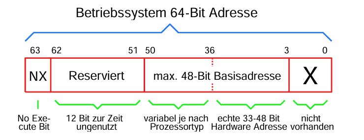
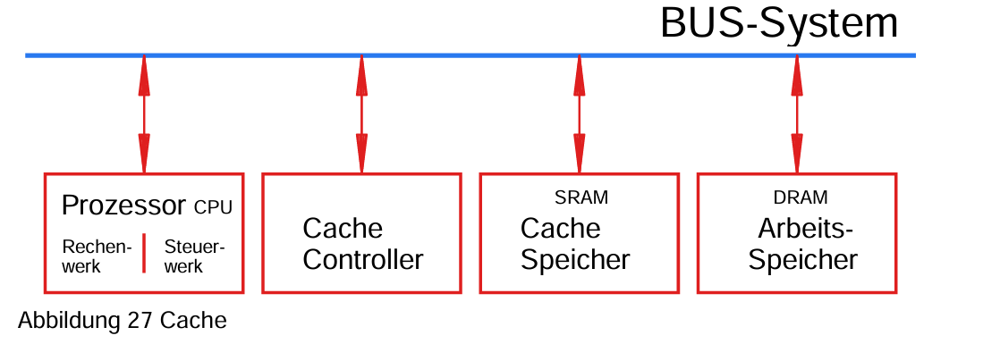

## 1.5 Halbleiter
- In den 1960er Jahren hat es einige Computer aus diskreten Bauteilen gegeben.
- In 1970 Jahren wurden die ersten 4-Bit-Mikroprozessoren von Intel (4004) entwickelt. 
- Massenproduktion von Mikroprozessoren begann in den 1980er Jahren. mit dem 8080 von Intel und dem 6800 von Motorola.

## 2.2 Klassifizierung von Betriebsystemen
### 2.2.1 Bitbreite
- Bitbreite von Betriebssystemen wird unterschieden durch die Menge des adressierbaren Speichers. *(manchmal wird die Speicherbandbreite künstlich limitiert)*
- Heutzutage sind folgende Systeme auf dem Markt:
    - 16-Bit-Systeme (max. 64KB)
    - 20-Bit-Systeme (16Bit + Segmentierung bis 1MB)
    - 32-Bit-Systeme (max. 4GB)
    - 64-Bit-Systeme (max. 16EB = 18 Millionen TB)

### 2.2.2 64-Bit Verwechselung

- Adressierung eines Datums dauert bei 64-Bit doppelt so lange wie bei 32-Bit, da die Adresse über den Datenbus übertragen werden muss.
- Hype auf 64-Bit-Betriebssysteme entstand durch Verwechslung der Bitbreite des Betriebssystems mit der Systembreite der CPU.
Bei einem 64-Bit-Betriebssystem muss jede Speicheradresse 64 Bit breit sein.

- Vorteile von 64-Bit-Betriebssystemen bestehen nur bei Nutzung von mehr als 4 Gigabyte Speicher und wenn eine Anwendung dies benötigt.
- Aktuell gibt es keine Prozessoren mit mehr als 45 echten Adressleitungen.  
--> 64-Bit-Betriebssysteme sind in Wirklichkeit nur max. 45-Bit-Betriebssysteme und können nicht mehr als 256 Terabyte echten Speicher ansprechen.

### 2.2.3 NX-Bit

- Einige Prozessorhersteller haben begonnen, Sonderbedeutungen in diese Bits einzubauen.
- Beispiel: Höchstes Bit der Adresse (Bit Nr. 63) kennzeichnet, ob an der Adresse Daten oder ausführbarer Programmcode abgelegt ist.
- Zweck: Erschwerung für Schadprogramme, Schadcode in den Speicher einzuschleusen.
- No-eXecute-Bit (NX-Bit) dient dieser Sicherheitsfunktion.
- NX-Bit wurde 2003 von AMD mit dem Athlon64 eingeführt.
- Aktuell wird das NX-Bit von allen Betriebssystemen unterstützt.

## 2.3.3 Arbeitsspeicher/Cache
- Standard-Prozessoren wurden anfangs mit wenigen MHz betrieben.
- Dynamischer Speicher (DRAM) war als Arbeitsspeicher schnell genug.
- Bis in die 90er-Jahre wurde preiswertes dynamisches RAM verwendet.
- Mit Taktfrequenzen über 20 MHz wurde der langsame Speicher problematisch, da die CPU auf den Speicher warten musste.
- Lösung ab den ersten 32-Bit-Systemen: Ein schnellerer Zwischenspeicher (Cache) zwischen CPU und Speicher.
- Cache-Zwischenspeicher wurde als Statisches-RAM (SRAM) ausgeführt.
- Cache-Controller verwaltet, welche Daten im Cache stehen. *(ein eigener kleiner Computer für die Speicherverwaltung)*
- Ziel des Cache-Controllers: sicherstellen, dass benötigte Daten im Cache sind (Cache-Hit), bevor die CPU sie anfordert.
- Bei Cache-Miss muss die CPU auf den langsamen DRAM-Hauptspeicher warten.
- CPU-Hersteller haben ab steigenden Taktfrequenzen den Cache inklusive Cache-Controller in die CPU integriert (bei Intel ab i486).
- Anfangs waren nur kleine Cache-Größen (<16 kByte) möglich.
- Externer Cache wurde als Second-Level-Cache beibehalten und später integriert (ab ca. 2000).
- Neueste Entwicklungen (ab 2018) integrieren einen Third-Level-Cache (L3-Cache) bis über 20 MB in die CPU.

## 2.3.4 CPU
### 2.3.4.1 Generischer Aufbau einer CPU
- CPU (Central Processing Unit) ist das zentrale Element in einem Computer.
- Früher das einzige aktive Element, mittlerweile gibt es in modernen Computern mehrere, auch unterschiedliche CPUs.
- CPU bedient alle Busse: Adressbus, Datenbus, Steuerbus und setzt verschiedene Vorgänge in Gang.
- Interner Aufbau der CPU wird mit Registern dargestellt (1 Bit Speicher-Bausteine in Gruppen von  8-16-32 oder 64-Bit *jeweils Abhängig von der CPU-Architektur*)
- Frühe CPUs nutzten einen Akkumulator für arithmetische oder logische Funktionen.
- Moderne CPUs können Operationen mit jedem Register durchführen.

### 2.3.4.2 Aktueller CPU-Aufbau
- Langsamer Speicherzugriff auf DRAM-Hauptspeicher bleibt trotz 3 Cache-Ebenen ein Problem.
- Erste Lösungsversuche: 32-Bit-Prozessoren mit 64-Bit-Datenbus nach außen. --> Verdoppelung der Datenübertragungsgeschwindigkeit. **ABER** heutzutage nicht mehr möglich, da CPUs intern mit 64-Bit arbeiten.

- Moderne Prozessoren (ab ca. 2010) haben keine klassische Busstruktur mehr außerhalb der CPU. *(Aber weiterhin innerhalb der CPU)*
- Speicherinterface wurde stark verändert, um die Datenübertragung zu beschleunigen.
- Mehrere Speicherkanäle und gemultiplexte Adressleitungen sind jetzt vorhanden. *(DRAM-Speicher wird sowieso in 2 oder 4 Kanälen angesprochen, also aufteilung der Speicheradressen)*

### 2.3.4.3 Fehlende Adressleitungen *(ab 32-Bit-Prozessoren)*
- Speicheradressierung ist historisch bedingt byteweise organisiert.
- 32-Bit-Prozessoren übertragen immer 4 Bytes auf einmal, daher werden die beiden untersten Adressleitungen nicht mehr benötigt. *(da 2^2 = 4)* 
    - Beispiel: Angenommen, ein 32-Bit-Prozessor möchte auf die Adresse 0x00000004 zugreifen. Da er immer 4 Bytes auf einmal liest, überspringt er die Adressen 0x00000001, 0x00000002 und 0x00000003, weil diese alle innerhalb des ersten 4-Byte-Wortes (Adresse 0x00000000) liegen würden.
- Einzelnes Byte wird durch zusätzliche Busleitungen "Byte Enable" BE0# - BE3# adressiert.
- Bei 64-Bit-Prozessoren wird dies mit acht Byte Enable Leitungen BE0# - BE7# weitergeführt. (Da hier immer 8 Bytes übertragen werden) *(2^3 = 8)*

### 2.3.4.4 Takt und Timing
- Erste Computer hatten genau einen Systemtakt von einem Taktoszillator (meistens Quarzoszillator).
- Ab den 1990ern wurde der Takt innerhalb der CPU erhöht, außerhalb entwickelte sich der Takt auf einige 100 MHz weiter.
- Hohe Taktfrequenzen auf Leiterplatten führen zu Signalintegritätsproblemen.
- Innerhalb der CPU wird mit einem höheren Takt gearbeitet, die Taktvervielfachung erfolgt mittels PLL *(Phase-Locked Loop: elektronische Schaltung zur Frequenzvervielfachung)*
- Speichercontroller in der CPU entkoppelt die unterschiedlich schnellen Busse.
- Maximale Taktfrequenz von 200-300 MHz wurde um das Jahr 2000 erreicht.
- Schnellere Datenübertragung durch 2 oder 4 Datenwörter pro Taktperiode.

## 2.3.6.2 Magnetischer Massenspeicher

### Bandlaufwerke
- Anfänge: Magnetische Massenspeicher begannen mit Magnetbändern, wobei anfangs echte Audio-Tonbänder verwendet wurden. In den 1980er Jahren wurden normale Audiokassettenrekorder mit Kompaktkassetten genutzt.
- Datenaufzeichnung: Häufig erfolgte die Aufzeichnung frequenzmoduliert, was gut zur Audiotechnologie passte.
- Aktuelle Nutzung: Magnetbänder werden heute noch als Streamer für Backups verwendet. Es gibt verschiedene Formate, die digital auf Band aufzeichnen.
- Vor- und Nachteile: Der sequenzielle Zugriff ist sowohl ein Hauptvorteil als auch ein Nachteil. Die Zugriffszeit kann im Minutenbereich liegen, was den schnellen Zugriff auf Daten behindert, aber auch vor Schadprogrammen schützen kann, da nicht alle Daten direkt erreichbar sind und somit nicht sofort zerstört werden können.
- LTO-Ultrium-Bandlaufwerke: Die aktuellen Streamer-Techniken basieren auf LTO-Ultrium-Bandlaufwerken (Linear Tape Open), die verschiedene Generationen von LTO1 bis LTO8 umfassen, wobei einige rückwärtskompatibel sind.

### Diskettenlaufwerke (Floppy-Disk)
- Historie: Die Diskette war in den 1980er Jahren der mobile Massenspeicher für Computer. Sie fungierte als Zwischenlösung zwischen Magnetbandspeicher und Magnetplatte.
- Mechanisches Verhalten: Ähnlich dem Magnetband mit dem Vorteil des wahlfreien Zugriffs.
- Nachteile: Da es direkten Kontakt zwischen Schreiblesekopf und Medium gab, litten Disketten unter starkem Verschleiß und hatten eine geringe Lebensdauer.
- **ACHTUNG** Das Datenformat auf Disketten ist über verschiedene Computertypen hinweg nicht kompatibel.
- Entwicklung: Disketten wurden im Laufe der Jahre kleiner und wiesen eine höhere Speicherdichte auf.
- Ende der Nutzung: Mit dem Aufkommen von Flash-Speichern im USB-Stick-Format wurden Disketten ab ca. 2005 fast vollständig aufgegeben, abgesehen von einigen professionellen Anwendungen *(z.b. Musiker-Equipment)*.

### Festplattenlaufwerke (HDD)
- Funktionsweise: Magnetplatten funktionieren ähnlich wie Magnetbänder oder Disketten, wobei der Schreib-/Lesekopf über der Platte schwebt. Der Luftwirbel, der durch die Rotation der Platte entsteht, sorgt dafür, dass der Schreib-/Lesekopf die Platte im Datenbereich niemals berührt. Falls die Platte ausgeschaltet wird und die Umdrehung stoppt, fährt der Schreib-/Lesekopf auf eine Parkposition. *(Auf der Parkposition sind keine Daten gespeichert)*

- Vorteile: Durch die hohe Rotationsrate bieten Festplatten kurze Zugriffszeiten und hohe Übertragungsraten.
- Entwicklung: Festplattenkapazitäten haben sich von anfangs einigen Megabytes auf heute über 10 Terabyte pro Platte gesteigert. Die Schnittstellen haben ebenfalls eine Evolution durchlaufen, anfangs MFM, dann paralell (IDE/SCSI) und schlussendlich zu Serial ATA (SATA) und SAS.
- Giant Magneto Resistance: Bis zur Entdeckung des GMR-Effekts (Giant Magneto Resistance) war der Speicherzuwachs stagnierend. Mit dem GMR-Effekt konnten die Speicherdichten weiter erhöht werden. 
- Shingled Magnetic Recording: 
    - Prinzip:
        - Schreibkopfgröße: Der Schreibkopf ist physikalisch größer als der Lesekopf. Dies führt dazu, dass beim Schreiben die benachbarten Spuren teilweise überschrieben werden.
        - Überlappendes Schreiben: Bei SMR werden die Magnetzonen absichtlich überlappend geschrieben. Der nachfolgende Schreibvorgang überschreibt teilweise die vorherigen Magnetzonen, was Platz spart und die Datendichte erhöht.
    - Vorteile:
        -  Erhöhte Speicherkapazität: Durch das Überlappen der Spuren können mehr Daten auf derselben Plattenfläche gespeichert werden, was zu einer höheren Speicherdichte führt.
    - Nachteile:
        - Komplexes Schreiben: Da benachbarte Spuren überschrieben werden, müssen beim Ändern von Daten größere Datenblöcke erneut geschrieben werden.
        - Verwaltungsaufwand: Es muss ein zusätzlicher Verwaltungsaufwand betrieben werden, um sicherzustellen, dass bei einer Änderung der Daten der gesamte betroffene Block neu geschrieben wird.
    - Technische Details:
        - Lücken: Um die vollständige Überschreibung der gesamten Platte zu vermeiden, werden in regelmäßigen Abständen Lücken freigelassen.
        - Schreibvorgänge: Bei einer Datenänderung muss der gesamte Block bis zur nächsten Lücke zuerst ausgelesen und danach wieder komplett neu geschrieben werden.

- Ausblick:
    - Heat Assisted Magnetic Recording (HAMR): 
        --> Mithilfe eines Lasers wird die Magnetschicht erhitzt, wodurch die notwendige magnetische Feldstärke reduziert wird und damit der Schreibkopf kleiner gemacht werden kann.
    - Microwave Assisted Magnetic Recording (MAMR):
        --> Mithilfe von elekromagnetischer Mikrowellenstrahlung wird die Magnetschicht "magnetisch aufgeweicht", wodurch die notwendige magnetische Feldstärke reduziert wird und damit der Schreibkopf kleiner gemacht werden kann.

## 2.4 Architekturen

### 2.4.1 Von-Neumann-Architektur
- Grundkonzept:
    - Ein einziges Bussystem: Es gibt nur ein Bussystem, das für die Übertragung aller Datenarten verwendet wird. Dies umfasst sowohl die Programmdaten als auch die Programmbefehle.
- Speicher: 
    - Der gleiche Speicher wird für Daten und Programme genutzt, was bedeutet, dass der Speicher und der Bus abwechselnd für beide genutzt werden müssen.
- Vorteile:
    - Einheitlicher Speicher: Es wird nur eine "Art" von Arbeitsspeicher benötigt, der sowohl für Daten als auch für Programme zuständig ist. Dies vereinfacht die Speicherverwaltung und reduziert die Kosten.
- Nachteile:
    - Bus- und Speicherüberlastung: Da der Bus und der Speicher sowohl für Daten als auch für Programme verwendet werden, kann es zu Engpässen kommen, wenn beide gleichzeitig benötigt werden.
    - Cache-Trashing: Mit der Einführung von Caches in den 90er-Jahren entstand das Problem, dass Daten und Programmbefehle sich gegenseitig aus dem Cache verdrängten. Dieses Problem wurde teilweise durch die Einführung von getrennten Caches für Daten und Programmbefehle gelöst, was eher einer Harvard-Architektur entspricht.
    - Selbstmodifizierender Code: Ein großer Nachteil der Von-Neumann-Architektur ist die Möglichkeit, dass Software ihren eigenen Programmcode ändern kann. Dies kann von bösartiger Software ausgenutzt werden, um sich auszubreiten.

### 2.4.2 Harvard-Architektur
- Grundkonzept:
    - Getrennte Speicher und Busse: Die Harvard-Architektur zeichnet sich durch physikalisch getrennte Speicher- und Bussysteme für Programmcode und Daten aus. 
- Vorteile:
    - Schneller Speicherzugriff: Durch die Trennung der Busse für Programmcode und Daten kann der Prozessor gleichzeitig auf beide Arten von Speicher zugreifen. Dies führt zu einer theoretischen Verdopplung der Zugriffsgeschwindigkeit im Vergleich zur Von-Neumann-Architektur.
    -  Sicherheit: Ein laufendes Programm kann seinen eigenen Programmcode *fast* nicht überschreiben, was das Risiko von bösartigen Softwaremanipulationen reduziert. Der Programmspeicher ist während der normalen Programmausführung nur lesbar und oft in ROM (Read-Only Memory) gespeichert, insbesondere bei eingebetteten Systemen.

## 2.5 PC-Bussyteme

### 2.5.1 ISA-Bus *(Industry Standard Architecture)*

- Einführung und Entwicklung:
    - Entwickelt von IBM in den 1980er-Jahren.
    - Ursprünglich als XT-BUS mit 8-Bit-Datenbusbreite und 4,7 MHz.
    - Später erweitert auf 16 Bit mit einer Taktfrequenz von 8,33 MHz (Übertragungsrate 16,6 MB/s).
- Eigenschaften:
    - Der gesamte Systembus des Computers ist direkt auf den ISA-Stecker geführt.
    - Ein Entwurf zur Erweiterung auf 32 Bit (EISA) wurde nicht erfolgreich umgesetzt.
- Verwendung:
    - Auch heute noch in Industrieanwendungen verwendet, oft mit zusätzlicher ISA-Hardware-Emulation, um moderne Systeme nicht mit niedrigen Geschwindigkeiten zu betreiben.

### 2.5.2 PCI-Bus *(Peripheral Component Interconnect)*

- Einführung und Entwicklung:
    - Mitte der 1990er-Jahre von einem Konsortium mehrerer Firmen entwickelt.
    - **Keine** direkte Verbindung mehr zur CPU, sondern über den Chipsatz des Prozessors.
- Eigenschaften:
    - Daten und Adressleitungen werden gemultiplexed.
    - Daten- und Adressbreite: 32 Bit.
    - Taktfrequenz: 33 MHz.
    - Übertragungsrate: Maximal 133 MB/s im Burst-Modus.
- Erweiterungen:
    - 64-Bit-Variante (PCI-X) für Serverboards, die Taktfrequenz wurde erhöht und QDR eingeführt, wodurch Übertragungsraten bis zu 4,2 GB/s erreicht wurden.

### 2.5.3 PCIe-Bus *(PCI Express)*

- Problematik paralleler Bussysteme:
    - Signale müssen auf allen Leitungen gleich lang unterwegs sein, was durch Mäander auf Leiterplatten erreicht wurde.
    - Physikalische Grenzen bei parallelen Konzepten wurden erreicht.
- Eigenschaften:
    - Serielle Punkt-zu-Punkt-Verbindung (Lane) ersetzt den eigentlichen BUS.
    - Taktfrequenz: ca. 2,5 GHz (PCIe-1), was eine Verdopplung der Übertragungsrate von 32-Bit-PCI ergibt.
    - Serielle Taktübertragung erfolgt mittels PLL (Phase-Locked Loop).
    - Mehrere Lanes können zusammengeschaltet werden (bis zu 16 Lanes), ohne eine parallele Übertragung zu bilden.
- Vorteile:
    - Störsichere Übertragung durch differenzielle Paare.
    - Für Software unsichtbar, da die parallel-seriell-parallel-Wandlung von der Hardware übernommen wird.

## 3.3.1 Rechenwerk Addition

### 3.3.1.1 Halbaddierer

**Addition von einstelligen Dualzahlen**

### 3.3.1.2 Volladdierer

**Addition von Dualzahlen mit Übertrag**

**Addition von zwei einstelligen Dualzahlen mit einem Übertrag**

### 3.3.1.3 Paralleladdierwerk

**Addition von Dualzahlen mit mehreren Stellen**

**Ablauf:** Um eine komplette Addition zweier Register durchzuführen:
1. Summanden stehen in zwei Registern mit Bitbreite N.
2. Steuersignal "Addition" aktiviert das Paralleladdierwerk.
3. Mit der nächsten Taktflanke wird das Ergebnis in das A-Register übernommen.

**Ripple-Carry-Addition:** Die Addition erfolgt bitweise von LSB (Least Significant Bit) zu MSB (Most Significant Bit). Der Übertrag wird von einem Bit zum nächsten weitergereicht.  
    `--> Hierbei wird pro Dualzahl ein Volladdierer benötigt.`  
***ACHTUNG*** *Im ungünstigsten Fall muss ein Übertrag durch alle Bits gereicht werden, was zu einer langen Verzögerung führt.*

**Carry-Lookahead-Addition:** Die Überträge werden parallel berechnet, was zu einer schnelleren Addition führt.  

### 3.3.1.4 Inkrement

**Beschreibung:** Inkrementieren ist eine häufig benötigte arithmetische Funktion, z.B. bei Schleifenberechnungen.

**Optimierung:** 
- Addition mit 1, wobei fast alle Stellen des einen Summanden null sind.
- Pro Binärstelle (außer LSB) kann ein Volladdierer durch einen Halbaddierer ersetzt werden.

## 3.3.7 Faktor 256 hoch x
**Binäre Schiebeoperation**
Die Multiplikation mit 256 in einer binären Zahl entspricht einer Schiebeoperation (Shift-Operation) um 8 Bit nach links.  
`--> 256 = 2^8`
- Optimierung durch Compiler: Der Compiler erkennt die Shift-Operation um 1-Byte und führt keine Multiplikation durch, sondern greift direkt auf die Speicheradresse um 1-Byte weiter zu.

## 3.3.9
## 4.4
## 5.2.2.1
## 5.2.2.3
## 5.3.4.6
## 6.3.2.4
## 6.3.8.4
## 6.3.9.1
## 7.2.1
## 7.2.2
## 7.3.3
## 7.4.2.4